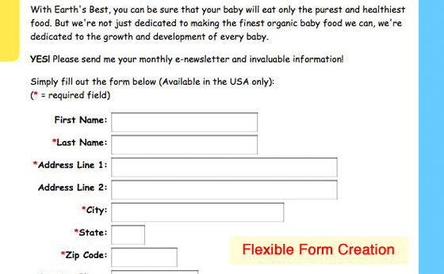
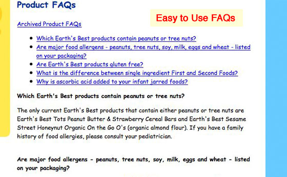
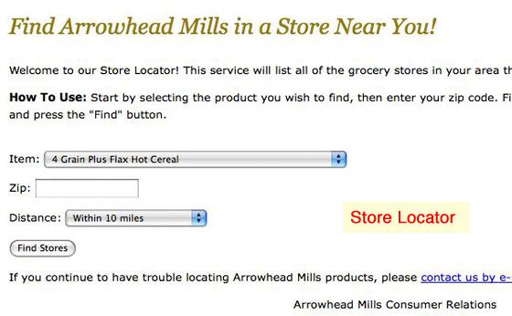
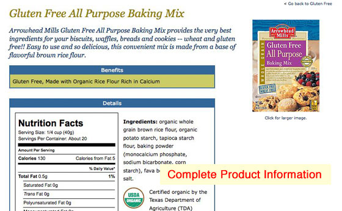
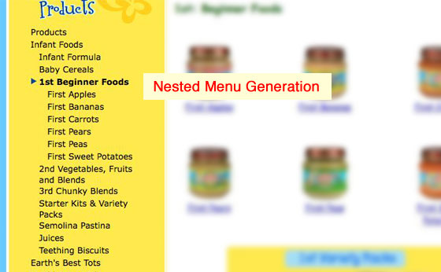
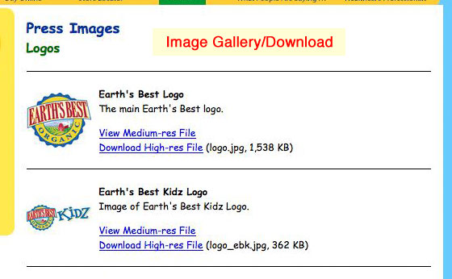

# hcgPublic

hcgPublic is an antiquated tag-based framework for injecting dynamic content into a static website. Written in PHP, I built it in the early 2000s when the number of branded sites I was responsible for was growing quickly. The goals of this project were to create a system that could run scripts on multiple websites from a single code base, be integrated easily into existing static websites and be completely skinned on each site to match the existing design.

These days you would likely accomplish the same thing using APIs and shared Javascript components. hcgPublic does it all on the server side, which was what I knew to do at the time.

The system served us well for a number of years, but it was eventually replaced by [Coolbrew](https://github.com/jimappleg8/coolbrew/).

## Framework Features

The framework uses a loosely connected set of PHP classes as the foundation, providing a solid base for things like connecting to the database (ADODB), building forms (PEAR HTML_QuickForms), and processing templates (Smarty Templates). As other classes were needed, they could easily be added in.

## Usage

**Disclaimer:** This project is here as a reference for anyone wanting to doo something similar. The database schema no longer exists, so it would need to be recreated before anyone could use this project directly.

With that said, usage of the system was pretty simple:

1. Upload the `lib` folder on your server at the same level as your website files (i.e. outside of any of your websites' document root folders). 
2. Open the `lib/config.inc.php` file with a text editor and enter your configuration information.
3. Edit the `include_path` directive in your php.ini file to include the `lib` folder, or use an .htaccess file in each of your websites to add the directory to the path.
4. Connect your web pages to hcgPublic by including the `config.inc.php` file at the top of the page.

## Modules

I developed more than 20 modules for the system including products, FAQs, store locator, webforms, LDAP directory search, htDig search interface, image gallery, and stock quote widget.

